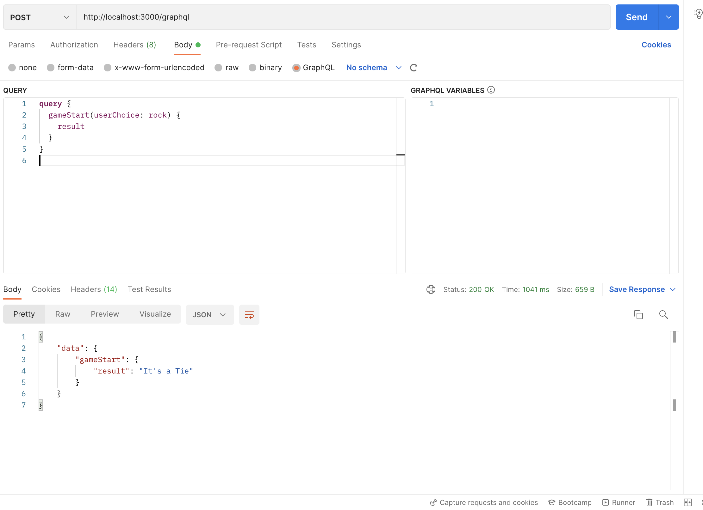

# Rock - Paper - Scissor Game

## To play the game
- Step One: Clone the repo

```
    git clone https://github.com/jigmetnamgyal/rps-game.git
```

- Step two: Install the gem

```bash
    bundle install
```

- Step three: Create the database

```
    rails db:create
```

- Ste four: Run the `rspec`

```
    rspec
```

- Step five: Start the server

 ```
    rails s
```

- Step Five: Open Postman or Altair and send the following request

```graphql
    query {
        gameStart(userChoice: rock) {
            result
        }
    }
```

- Expected Result:


## Description

- This is a small rock paper scissor game implemented in Ruby on Rails using **GraphQL API** and **Faraday gem** for 3rd party integration.

- A user make a choice from _Rock_, _paper_ and _Scissor_ and compete with the _crub bot_ 

- The application allow a user to choose rock, paper, or scissors
- The application make a request to the external api to retrieve the server’s throw.  
- Error handling is done
- If the api does not work or run out of time, an alternative of generating a random throw locally is handled by rescuing `Faraday::ConnectionFailed`
- The application then respond with a result - whether the user won, lost or tied based on the server's throw

## Rules

- Rock beats scissors
- Scissors beats paper
- Paper beats rock
- Identical throws tie (rock == rock, etc.)

- If we threw in Hammer as a choice then since my type of user choice is enum, it will throw error and specify user that the input is invalid choice.

## Technologies Used

- GraphQL for API
- Faraday to make external api request and error handling

### Development and Testing
- Pry for debugging
- rspec-rails for unit testing
- rubocop-rails and rubocop-rspec for code clean up


